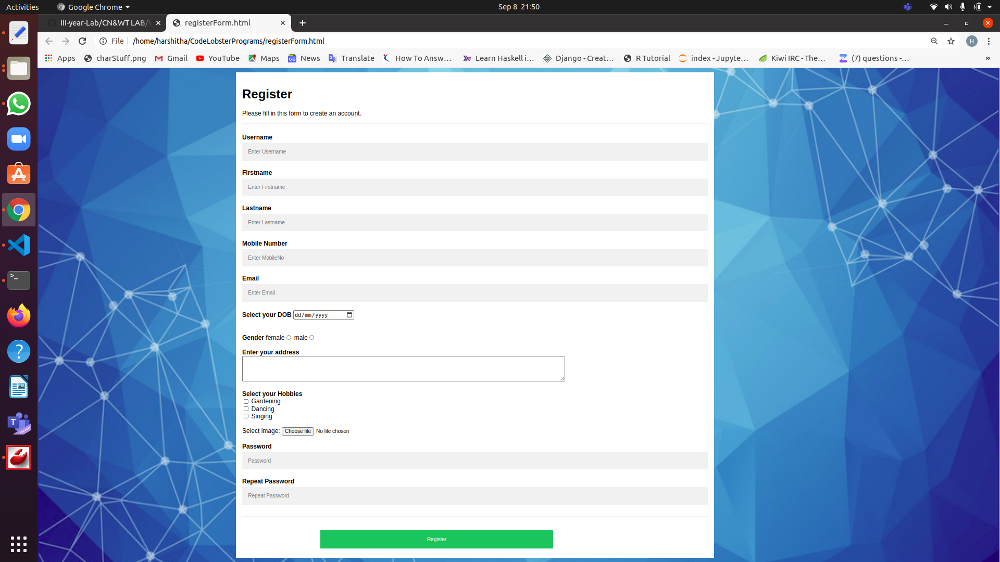

# Experiment 1

## Aim of the Experiment
Develop static pages (using Only HTML) of an online book store. The pages should resemble: www.amazon.com. The website should consist the following pages. a)Home page b)Registration and user Login c)User Profile Page d)Books catalog e)Shopping Cart f)Payment By credit card g)Order Conformation

## Steps or Procedure of experiment

### RegisterForm.html
This page includes registration form with all required fields such as username, name, mobile, emailid, age, uploading image, gender, address, date of birth ,hobbies and password.

## Output
### Register Form Page:

